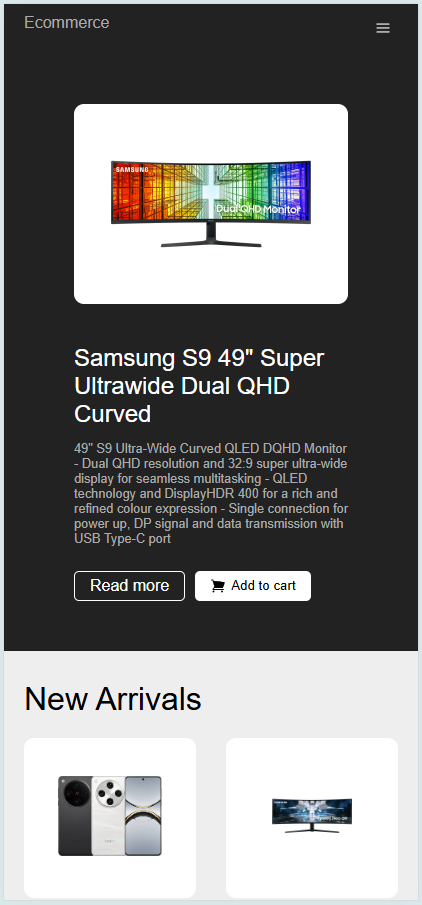

# E-commerce Frontend (Built with Next.js)

Welcome to the E-commerce Frontend repository! This project is a modern, performant, and scalable frontend for an e-commerce platform, built using Next.js and a suite of powerful JavaScript libraries.

## 🚀 Overview

This application provides the client-side experience for an online store, allowing users to browse products, add items to their cart, and complete purchases. It leverages Next.js for server-side rendering (SSR) and static site generation (SSG) capabilities, ensuring fast load times and a great user experience. Backend functionalities like database interaction and payment processing are handled via Next.js API routes.

## ✨ Features (Example - customize as needed)

- **Product Listing & Filtering:** Browse a catalog of products with options for searching and filtering.
- **Product Detail Pages:** View detailed information, images, and pricing for each product.
- **Shopping Cart:** Add/remove items, update quantities, and view cart summaries.
- **Secure Checkout:** Integrated with Stripe for secure payment processing.
- **User Accounts:** (If applicable) Functionality for user registration, login, and order history.
- **Responsive Design:** Adapts to various screen sizes for a seamless experience on desktop and mobile.
- **SEO Optimized:** Leveraging Next.js features and `react-helmet` for better search engine visibility.

## 🖼️ Screenshots

| Desktop                                              | Mobile                                              |
| ---------------------------------------------------- | --------------------------------------------------- |
|  |  |

## 🚀 Live Demo

### URL: https://nextjs-ecommerce-front.netlify.app/

## 🛠️ Technologies Used

This project is built with a modern stack:

- **Core Framework:**
  - [Next.js](https://nextjs.org/) (v13.4.12): React framework for production - providing SSR, SSG, API routes, and more.
  - [React](https://reactjs.org/) (v18.2.0): JavaScript library for building user interfaces.
- **Styling:**
  - [Styled Components](https://styled-components.com/) (v6.0.7): Visual primitives for the component age. CSS-in-JS library.
- **API & Backend (within Next.js API Routes):**
  - [Mongoose](https://mongoosejs.com/) (v7.4.2): Elegant MongoDB object modeling for Node.js, used within API routes.
  - [Stripe](https://stripe.com/docs/libraries/node) (v13.4.0): Payment processing integration.
  - [Axios](https://axios-http.com/) (v1.4.0): Promise-based HTTP client for making API requests from the client-side or server-side.
  - [Micro](https://github.com/vercel/micro) (v10.0.1): Asynchronous HTTP microservices library (often used with Next.js API routes or for simple Node.js services).
- **UI & UX:**
  - [React Icons](https://react-icons.github.io/react-icons/) (v4.11.0): Popular icon packs as React components.
  - [React Helmet](https://github.com/nfl/react-helmet) (v6.1.0): A document head manager for React, useful for SEO and page titles.
- **Linting & Code Quality:**
  - [ESLint](https://eslint.org/) (v8.45.0): Pluggable and configurable linter tool for identifying and reporting on patterns in JavaScript.
  - `eslint-config-next`: ESLint configuration specific to Next.js projects.
- **Build & Development Tools:**
  - `babel-preset-next`: Babel preset for Next.js.
  - `babel-plugin-styled-components`: Babel plugin for Styled Components (improves SSR, minification, and debugging).

## Prerequisites

- Node.js (v16.x or later recommended)3
- npm or yarn
- MongoDB instance (local or cloud-hosted like MongoDB Atlas)
- Stripe Account (for API keys)

## ⚙️ Getting Started

1.  **Clone the repository:**

    ```bash
    git clone https://github.com/jericrealubit/ecommerce-front.git
    cd ecommerce-front
    ```

2.  **Install dependencies:**

    ```bash
    npm install
    # or
    yarn install
    ```

3.  **Set up Environment Variables:**
    Create a `.env.local` file in the root of the project and add the following environment variables. Replace the placeholder values with your actual credentials.

    ```env
    # MongoDB Connection URI
    MONGODB_URI=your_mongodb_connection_string_here

    # Stripe API Keys
    STRIPE_PUBLISHABLE_KEY=your_stripe_publishable_key_here
    STRIPE_SECRET_KEY=your_stripe_secret_key_here

    # Base URL for your application (important for API calls, redirects, etc.)
    # For local development:
    NEXT_PUBLIC_URL=http://localhost:3000
    # For production:
    # NEXT_PUBLIC_URL=https://yourdomain.com
    ```

    - `MONGODB_URI`: Your MongoDB connection string.
    - `STRIPE_PUBLISHABLE_KEY`: Your Stripe publishable API key (used on the client-side).
    - `STRIPE_SECRET_KEY`: Your Stripe secret API key (used on the server-side within API routes).
    - `NEXT_PUBLIC_URL`: The public URL of your application.

4.  **Run the development server:**
    ```bash
    npm run dev
    # or
    yarn dev
    ```
    Open [http://localhost:3000](http://localhost:3000) with your browser to see the result.

## 📜 Available Scripts

In the project directory, you can run:

- `npm run dev` or `yarn dev`:
  Runs the app in development mode.
  Open [http://localhost:3000](http://localhost:3000) to view it in the browser.
  The page will reload if you make edits. You will also see any lint errors in the console.

- `npm run build` or `yarn build`:
  Builds the app for production to the `.next` folder.
  It correctly bundles React in production mode and optimizes the build for the best performance.

- `npm run start` or `yarn start`:
  Starts the production server (after running `npm run build`).

- `npm run lint` or `yarn lint`:
  Runs ESLint to check for code style issues and potential errors.

## 🏗️ Project Structure (Simplified)

```bash
ecommerce-front/
├── components/ # Reusable UI components
├── lib/ # Utility functions, Stripe/DB initializers
├── models/ # Mongoose schemas for MongoDB
├── pages/ # Next.js pages and API routes
│ ├── api/ # API routes (backend logic)
│ │ ├── products.js
│ │ └── checkout.js
│ ├── _app.js # Custom App component
│ ├── _document.js # Custom Document component
│ └── index.js # Homepage
├── public/ # Static assets (images, favicons)
├── styles/ # Global styles, theme configurations
├── .env.local # Environment variables (ignored by Git)
├── package.json
└── README.md
```

## 🚀 Deployment

The easiest way to deploy your Next.js app is to use the [Vercel Platform](https://vercel.com/new?utm_medium=default-template&filter=next.js&utm_source=create-next-app&utm_campaign=create-next-app-readme) from the creators of Next.js.

Check out the [Next.js deployment documentation](https://nextjs.org/docs/deployment) for more details on other hosting options. Remember to configure your environment variables on your deployment platform.

## 🤝 Contributing

Contributions are welcome! If you have suggestions or want to improve the project, please feel free to:

1.  Fork the Project
2.  Create your Feature Branch (`git checkout -b feature/AmazingFeature`)
3.  Commit your Changes (`git commit -m 'Add some AmazingFeature'`)
4.  Push to the Branch (`git push origin feature/AmazingFeature`)
5.  Open a Pull Request

## 📄 License

This project is licensed under the [MIT License](LICENSE.md) - see the `LICENSE.md` file for details (Consider adding an MIT License file if you don't have one).

---

Happy Coding!
